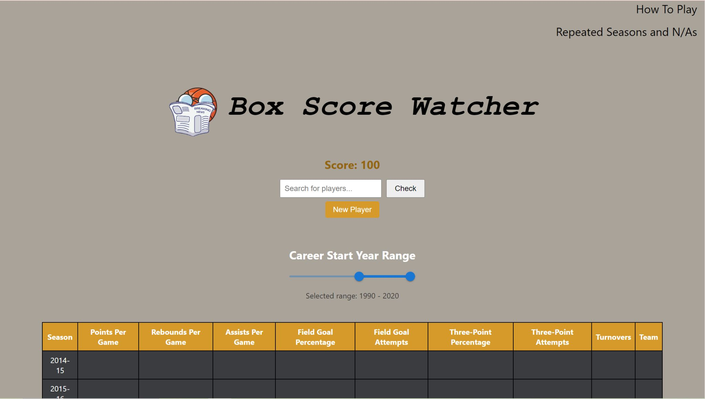

# Box Score Watcher

Box Score Watcher is an interactive basketball trivia web app that challenges users to guess NBA players based on hidden stats. The app dynamically fetches player statistics and allows users to reveal specific stat categories — but at the cost of their score.

  

## How It Works

- Type a player's name in the search bar to guess.
- Reveal stats like points, team, or rebounds to help — but lose points for each reveal.
- If you guess correctly, see how your score compares to the average.
- Click "New Player" to start a new round with a different player.
- Filter players by start year range or minimum points per game (PPG).

## Features

- Stat reveal system with weighted score penalties
- Search and suggestions
- Correct/Wrong guess modals with animations
- Slider filters for start year and PPG
- Debounced search for performance
- Score tracking and average score comparison
- Clean and responsive UI

## Tech Stack

**Frontend**
- React (Hooks + Functional Components)
- CSS (Custom + Component-based styles)
- Axios for API communication

**Backend**
- Python + Flask for API logic and data handling
- BeautifulSoup + Requests for data parsing
- In-memory caching and blocking logic for performance

## Backend Overview

The backend for Box Score Watcher is built using Python and Flask. It supports the gameplay by serving player data, handling stat requests, and managing caching to improve performance and reduce redundant requests.

### Technologies Used

- Flask – Lightweight Python web framework for building RESTful APIs
- Flask-CORS – Enables cross-origin requests from the React frontend
- Requests – Sends HTTP requests to retrieve player data
- BeautifulSoup – Parses and extracts stats from HTML responses
- In-Memory Caching – Temporarily stores fetched data to reduce load and improve speed
- Threading and Locks – Ensures thread-safe access to shared cache
- Retry Logic – Handles rate limiting and retries failed external requests
- Blocking Logic – Prevents the same player from being shown repeatedly in short timeframes

### API Endpoints

- `GET /api/players` – Returns a list of filtered players
- `GET /api/random_player` – Returns a randomly selected player not recently shown
- `GET /api/player/<letter>/<player_id>/ppg` – Returns a player’s career points per game
- `GET /api/player_stats?player_id=...` – Returns per-season stats for a given player

### Design Features

- Caching System  
  Uses an in-memory cache with expiration to reduce scraping frequency and speed up API responses.

- Player Block Window  
  Recently used players are temporarily blocked from being selected again to improve game variety.

- Retry and Error Handling  
  Automatically retries failed requests and handles rate limiting to keep data fetching reliable.

## Deployment (AWS)

The application is deployed using multiple AWS services to ensure scalability, performance, and cost-efficiency:

- **Amazon S3** – Hosts the static frontend files (HTML, JS, CSS) built with React.
- **Amazon CloudFront** – Delivers the frontend via a global content delivery network (CDN) for fast load times.
- **Amazon API Gateway** – Routes frontend `/api/*` requests to the backend.
- **Amazon EC2** – Used for load testing and as a fallback compute layer for backend services under high traffic.
- **Elastic Load Balancing (ELB)** – Distributes traffic between Lambda and EC2 instances during burst workloads.
- **Amazon Route 53** – (Optional) Handles DNS routing for the custom domain `boxscorewatcher.com`.

The backend includes short-term and long-term caching strategies to reduce duplicate requests and optimize performance. Load balancing via EC2 ensures reliability and redundancy during gameplay surges.

The architecture is designed for cost efficiency and scalability, with caching and short-term rate limiting to reduce redundant data fetches and improve API performance.

## Access to Backend Code

If you would like to see the backend implementation, feel free to reach out.

Contact: johnaddokufuor@gmail.com

